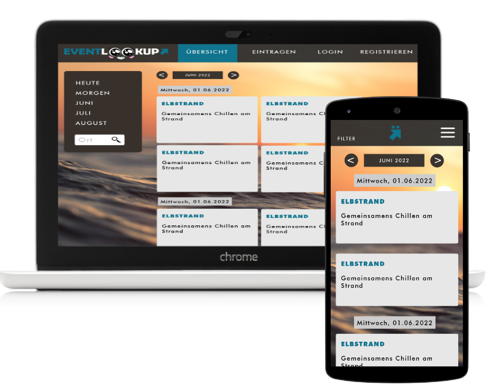

# Final Project ( EventLookUp )
This was a group work as a final project at Digital Career Institute

## Project Lead
- [Dietmar Eisner](https://github.com/Dima0687)
- [Jeremy Taag](https://github.com/Aypoleyth)

## Designer
- [Janina Spille](https://github.com/NinaSpille)

## Idea Provider
- [Felix Garske](https://github.com/FelixGA)

## Frontend
### Frontend Lead
- [Felix Garske](https://github.com/FelixGA)

### Frontend Developer
- [Meryem Pinarbasi](https://github.com/MeryemPin)
- [Janina Spille](https://github.com/NinaSpille)

### Frontend Developer Supporter
- [Jeremy Taag](https://github.com/Aypoleyth)
- [Dietmar Eisner](https://github.com/Dima0687)

## Backend
### Backend Lead
- [Dietmar Eisner](https://github.com/Dima0687)
### Backend Developer
- [Jeremy Taag](https://github.com/Aypoleyth)

[⬆️](#final-project--eventlookup-)
---
## Project Idea

Many probably know it, you look at various event sites, find the one or the other event also very appealing and would like to go there with his friends or family members. But these say off, there are other things to do, have no time and so on and so forth. Who should you go with if you don't want to go alone? Why not just arrange with others who have also already expressed interest in the event through their registration? This is to be realized by our project Event Look Up.

[⬆️](#final-project--eventlookup-)
---
## Road Map

- [ ] Dashboard
- [ ] Comments

[⬆️](#final-project--eventlookup-)
---
## Contact

|Developer|| |
|:--|:--:| --:|
|Dietmar Eisner  |    |  |
|Janina Spille   |  | |
|Meryem Pinarbasi|   | |
|Jeremy Taag     |   | |
|Felix Garske    |  |  |

[⬆️](#final-project--eventlookup-)

---
